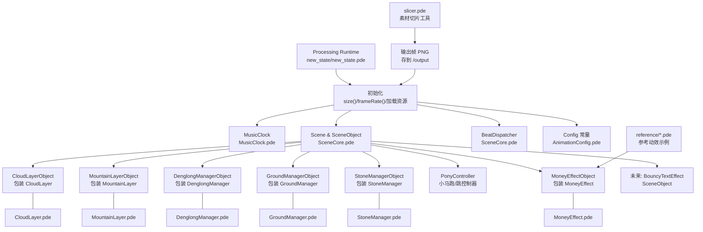
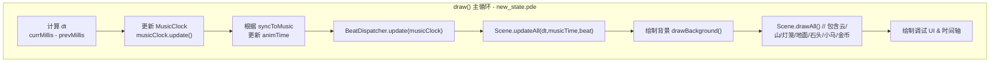
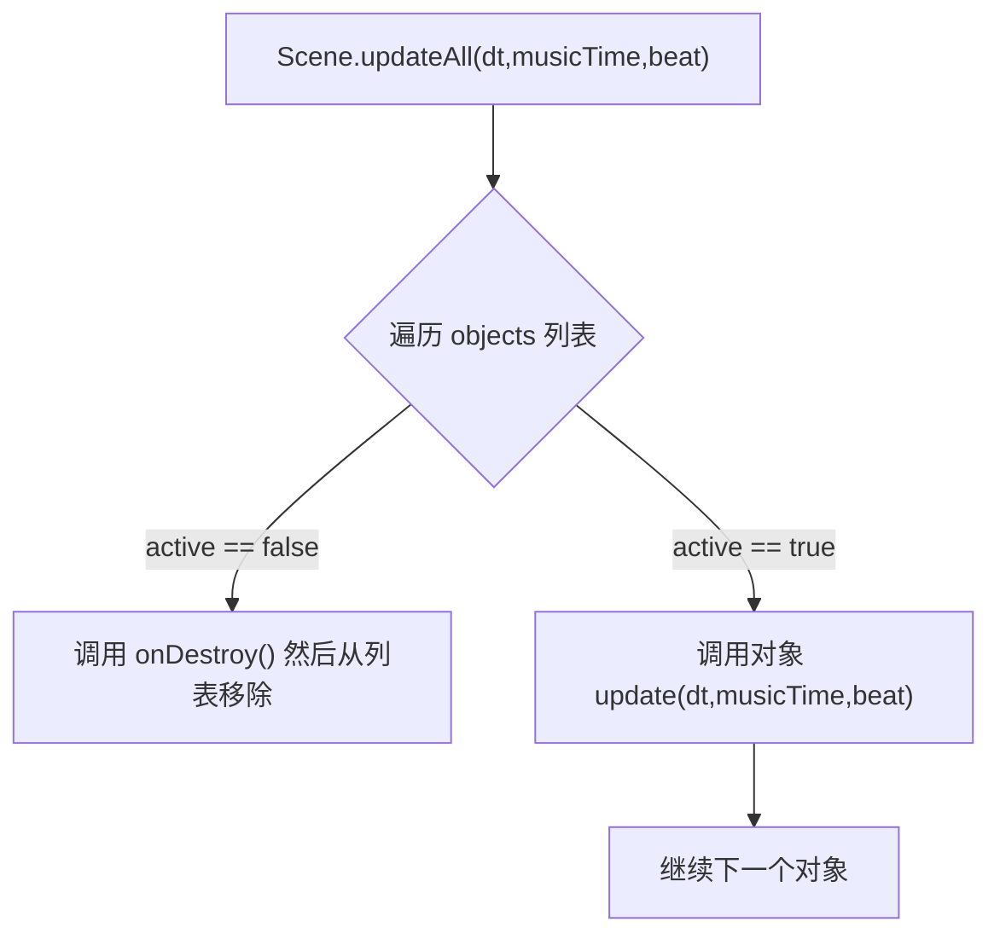
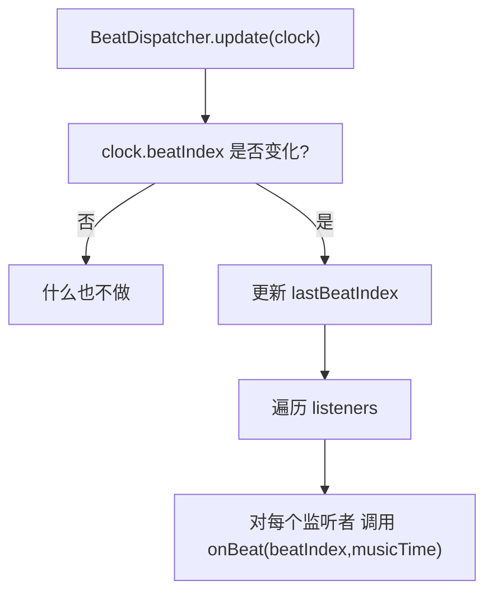
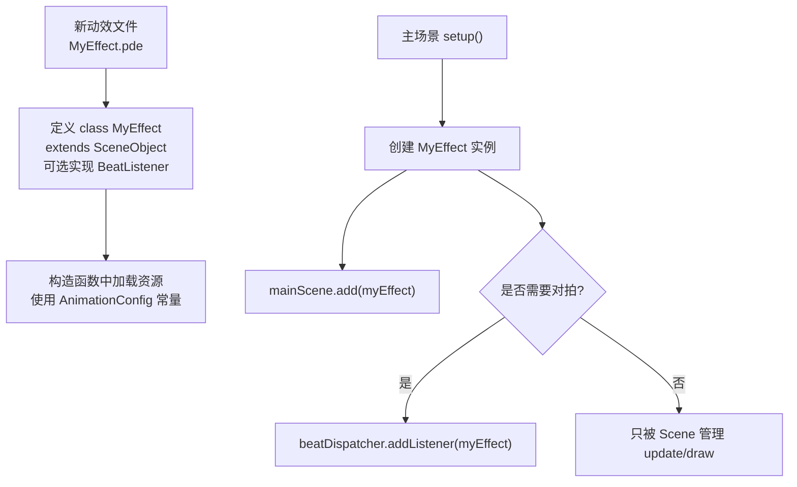
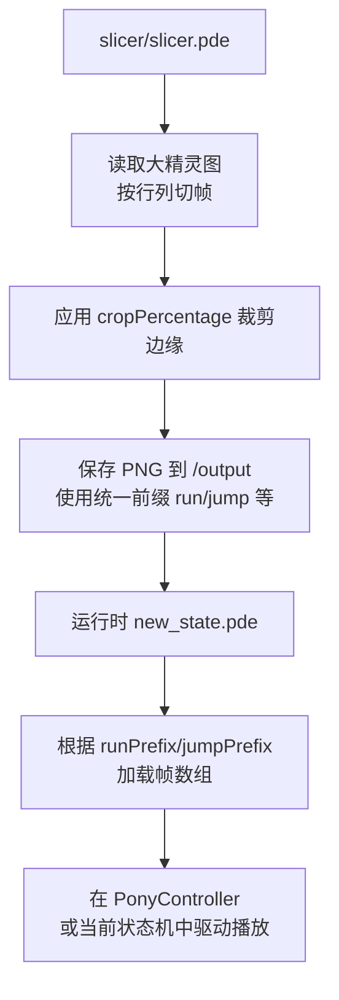

## 逻辑架构流程图（可渲染）

下面的流程图使用 Mermaid 语法书写，可在支持 Mermaid 的编辑器 / 平台中直接渲染。

---

### 1. 模块关系总览

---

### 2. 每帧渲染主流程

---

### 3. Scene / SceneObject 内部更新流程

---

### 4. BeatDispatcher 节拍分发流程

---

### 5. 典型“新动效模块”接入关系

---

### 6. 素材生成与运行时的关系

